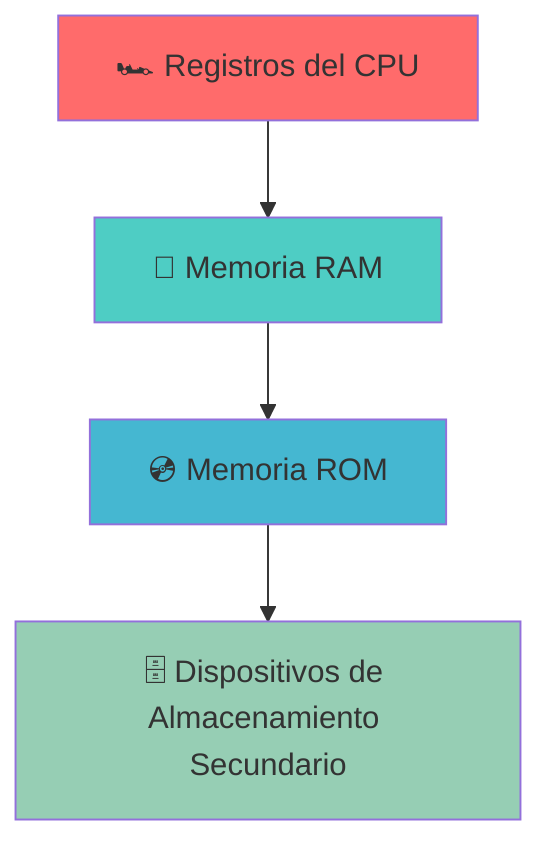
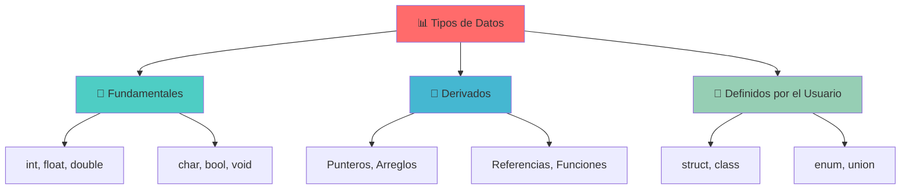

# 🧬 Variables y Conversiones en C++

---

### 👨‍🏫 **Instructor**

**MSc. José Jesús Cabrera Pantoja**
*Universidad Católica Boliviana*


---

## 📋 **I. Introducción y Repaso**

### 🎯 **Agenda de la Sesión**

| Status | Tema | Descripción |
|--------|------|-------------|
| ✅ | ~~Componentes de una computadora~~ | *Completado* |
| ✅ | ~~Compiladores e Intérpretes~~ | *Completado* |
| ✅ | ~~Representación de la Información~~ | *Completado* |
| 🔄 | **Entrada y Salida (I/O) en C++** | *En progreso* |
| 🔄 | **Variables y Tipos de Datos** | *En progreso* |
| 🔄 | **Conversión de Tipos (Casting)** | *En progreso* |
| 🔄 | **Manejo de Entradas del Usuario** | *En progreso* |

---

### 🏗️ **Jerarquía de Memoria**

> ⚡ La velocidad de acceso a los datos es crítica y se organiza de la siguiente manera:



| Nivel | Componente | Velocidad | Capacidad |
|-------|------------|-----------|-----------|
| 🥇 | **Registros del CPU** | *Más rápido* | *Menor* |
| 🥈 | **Memoria RAM** | *Rápido* | *Media* |
| 🥉 | **Memoria ROM** | *Medio* | *Media* |
| 4️⃣ | **SSD/HDD** | *Más lento* | *Mayor* |

---

## 💾 **II. Representación de Datos**

### 🔤 **Codificación de Texto: ASCII**

> 🧠 **Concepto clave:** Las computadoras operan con números binarios. Para representar texto, se utilizan estándares de codificación que asignan un número a cada carácter.

**ASCII** *(American Standard Code for Information Interchange)*: Es uno de los primeros y más importantes estándares. Asigna un valor numérico a 128 caracteres, incluyendo letras, números y símbolos de control.

| Carácter | Código ASCII | Representación Binaria |
|----------|--------------|----------------------|
| **A** | `65` | `01000001` |
| **B** | `66` | `01000010` |
| **C** | `67` | `01000011` |
| **D** | `68` | `01000100` |
| **E** | `69` | `01000101` |

---

### 🔢 **Sistemas Numéricos**

> 🔄 **La misma cantidad puede ser representada en diferentes bases numéricas.**

| Sistema Numérico | Base | Símbolos Utilizados | Interpretación del valor **11** |
|------------------|------|---------------------|--------------------------------|
| 🔢 **Binario** | `2` | `0, 1` | `3` *(1×2¹ + 1×2⁰)* |
| 🔟 **Decimal** | `10` | `0 a 9` | `11` *(1×10¹ + 1×10⁰)* |
| 🔠 **Hexadecimal** | `16` | `0 a 9, a a f` | `17` *(1×16¹ + 1×16⁰)* |

---

### ⚙️ **Notación en C++**

Se pueden utilizar prefijos para especificar la base de un número directamente en el código:

```cpp
int decimalNumber = 339;
int hexNumber     = 0x153;       // 0x para hexadecimal
int binaryNumber  = 0b101010011; // 0b para binario
```

#### 📐 **Fórmula de Conversión General**

**N<sub>b</sub> = Σ d<sub>i</sub> × b<sup>i</sup>**

**Ejemplo para 153₁₆:**

- 1 × 16² + 5 × 16¹ + 3 × 16⁰ = 256 + 80 + 3 = **339₁₀**

---

## ⚡ **III. Fundamentos de C++**

### 🌟 **Estructura Básica: "Hola Mundo"**

> 🚀 **El punto de entrada de todo programa en C++ es la función `main()`.**

```cpp
#include <iostream> // Librería para entrada y salida estándar

// La función main es donde comienza la ejecución del programa
int main() {
    // std::cout se usa para imprimir en la consola
    // std::endl inserta una nueva línea y limpia el búfer
    std::cout << "Hello World" << std::endl;

    // Un valor de retorno de 0 indica que el programa finalizó con éxito
    return 0;
}
```

#### ⚠️ **Nota sobre `using namespace std;`**

| ❌ **Malo** | ✅ **Bueno** |
|-------------|--------------|
| `using namespace std;`<br>`cout << "Hello";` | `std::cout << "Hello";` |

> 💡 **Aunque `using namespace std;` permite escribir `cout` en lugar de `std::cout`, se considera una mala práctica en proyectos grandes porque puede llevar a colisiones de nombres. Es preferible ser explícito.**


### 📝 **Comentarios**

> 📚 **Documentar el código es esencial para la mantenibilidad.**

| Tipo | Sintaxis | Uso |
|------|----------|-----|
| **Una línea** | `// Comentario` | Explicaciones breves |
| **Múltiples líneas** | `/* Comentario */` | Documentación extensa |

```cpp
// Este es un comentario de una sola línea.

/*
  Este es un comentario de bloque
  que puede abarcar múltiples líneas.
*/
```


## 📊 **IV. Variables y Constantes**

### 🎯 **Definición de Variables**

> 🧠 **Una variable es una porción de memoria con nombre que almacena un valor de un tipo específico.**

#### 📋 **Proceso de Creación de Variables**

| Paso | Acción | Sintaxis |
|------|--------|----------|
| 1️⃣ | **Declaración** | `tipo_de_variable nombre_de_variable;` |
| 2️⃣ | **Inicialización** | `nombre_de_variable = valor;` |
| 3️⃣ | **Declaración e Inicialización** | `tipo_de_variable nombre_de_variable = valor;` |
|
#### 💻 **Ejemplo Práctico**

```cpp
#include <iostream>
#include <string>

int main() {
    int score = 100;              // Variable de tipo entero
    double temperature = 23.5;    // Variable de tipo doble precisión
    std::string playerName = "Alex"; // Variable de tipo cadena de texto

    std::cout << "Jugador: " << playerName << std::endl;
    std::cout << "Puntaje: " << score << std::endl;

    // El valor de una variable puede cambiar
    score = 150;
    std::cout << "Nuevo puntaje: " << score << std::endl;

    return 0;
}
```


### 🔒 **Constantes**

> ⚠️ **Las constantes son variables cuyo valor no puede ser modificado después de su inicialización.**

```cpp
#include <iostream>

int main() {
    const double PI = 3.1415926535;
    // PI = 3.14; // ❌ Esto generaría un error de compilación.

    std::cout << "Valor de PI: " << PI << std::endl;
    return 0;
}
```

#### ⚠️ **Advertencia Importante**

> 🚨 **Una constante (`const`) debe ser inicializada en el mismo momento de su declaración.**

| ❌ **Incorrecto** | ✅ **Correcto** |
|-------------------|-----------------|
| `const double PI;`<br>`PI = 3.14159;` | `const double PI = 3.14159;` |

---

## 🧮 **V. Tipos de Datos y Memoria**

> 🔑 **El tipo de dato instruye al compilador sobre la naturaleza del valor que se almacenará y la cantidad de memoria que se debe reservar.**

### 🏗️ **Categorías de Tipos de Datos**



| Categoría | Tipos | Descripción |
|-----------|-------|-------------|
| 🎯 **Fundamentales** | `int`, `float`, `double`, `char`, `bool`, `void` | Tipos básicos del lenguaje |
| 🔗 **Derivados** | Punteros, Arreglos, Referencias, Funciones | Basados en tipos fundamentales |
| 👤 **Definidos por el Usuario** | `struct`, `class`, `enum`, `union` | Creados por el programador |

---

### 📏 **Tipos Fundamentales y sus Rangos**

> ⚠️ **La elección del tipo de dato correcto es crucial para la eficiencia y para evitar errores de desbordamiento (overflow).**

| Tipo | Tamaño Típico | Rango de Valores Aproximado | Emoji |
|------|---------------|----------------------------|-------|
| `char` | 1 byte | -128 a 127 | 🔤 |
| `unsigned char` | 1 byte | 0 a 255 | 🔠 |
| `short int` | 2 bytes | -32,768 a 32,767 | 📏 |
| `unsigned short int` | 2 bytes | 0 a 65,535 | 📐 |
| `int` | 4 bytes | -2.1 billones a 2.1 billones | 🔢 |
| `unsigned int` | 4 bytes | 0 a 4.2 billones | 🔢 |
| `long long int` | 8 bytes | -9 trillones a 9 trillones | 📈 |
| `float` | 4 bytes | ~7 dígitos de precisión | 🔸 |
| `double` | 8 bytes | ~15 dígitos de precisión | 🔹 |

---

### ⚙️ **Modificadores de Tipo**

| Modificador | Función | Ejemplo |
|-------------|---------|---------|
| `signed` / `unsigned` | Determina si el tipo puede almacenar valores negativos | `unsigned int positive_only` |
| `short` / `long` | Modifican el tamaño (y por ende el rango) del tipo base | `long long big_number` |

#### 💥 **Ejemplo de Desbordamiento (Overflow)**

```cpp
#include <iostream>

int main() {
    // Un 'short' podría desbordarse con este valor
    short int short_integer = 32768; // ⚠️ Comportamiento indefinido (overflow)

    // Un 'int' estándar puede manejarlo
    int integer = 32768;

    std::cout << "short: " << short_integer << std::endl;
    std::cout << "int:   " << integer << std::endl;
    return 0;
}
```

---

## 🔄 **VI. Conversión de Tipos (Casting)**

### 🤖 **Conversión Implícita**

> 🔁 **Ocurre automáticamente cuando el compilador convierte un tipo de dato a otro.**

```cpp
int x = 42;
double y = x; // y se convierte en 42.0 ✅
int z = 18.9; // z se trunca a 18 ⚠️ (pérdida de datos)
```

#### 📊 **Tabla de Conversiones Implícitas**

| Desde | Hacia | Resultado | Estado |
|-------|-------|-----------|--------|
| `int (42)` | `double` | `42.0` | ✅ Seguro |
| `double (18.9)` | `int` | `18` | ⚠️ Pérdida de datos |
| `char ('A')` | `int` | `65` | ✅ Promoción |

---

### 🎯 **Conversión Explícita**

> 🛡️ **Se realiza a petición del programador. Es más segura porque indica una intención clara.**

```cpp
#include <iostream>

int main() {
    double value_double = 65.7;
    char value_char = 'A';

    // Estilo C++: static_cast (preferido y más seguro)
    int casted_int = static_cast<int>(value_double);

    // Conversión de char a int para ver su valor ASCII
    int ascii_value = static_cast<int>(value_char);

    std::cout << "Double " << value_double << " casteado a int: " << casted_int << std::endl;
    std::cout << "Char '" << value_char << "' casteado a int: " << ascii_value << std::endl;

    return 0;
}
```

#### 🆚 **Comparación de Métodos de Casting**

| Método | Sintaxis | Seguridad | Recomendación |
|--------|----------|-----------|---------------|
| **C-style** | `(int)value` | ❌ Baja | No recomendado |
| **static_cast** | `static_cast<int>(value)` | ✅ Alta | ⭐ Preferido |
| **Funcional** | `int(value)` | ⚠️ Media | Ocasional |

---
## 📥 **VII. Entrada y Salida**

### 🎮 **Entrada de Usuario con `cin`**

> 🔄 **Para crear programas interactivos, se utiliza `cin` para leer datos del teclado.**

| Componente | Descripción |
|------------|-------------|
| `cin` | Flujo de entrada estándar |
| `>>` | Operador de extracción |

```cpp
#include <iostream>
#include <string>

int main() {
    int age;
    std::string name;

    std::cout << "Por favor, introduce tu nombre: ";
    std::cin >> name;

    std::cout << "Ahora, introduce tu edad: ";
    std::cin >> age;

    std::cout << "\nHola, " << name << ". Tienes " << age << " años." << std::endl;

    return 0;
}
```

---

### 🔣 **Secuencias de Escape**

> 📝 **Caracteres especiales que modifican el formato de la salida en una cadena de texto.**

| Secuencia | Descripción | Ejemplo de Uso |
|-----------|-------------|----------------|
| `\n` | Nueva línea | `"Línea 1\nLínea 2"` |
| `\t` | Tabulación horizontal | `"Columna 1\tColumna 2"` |
| `\\` | Barra invertida | `"C:\\Users\\Public"` |
| `\"` | Comillas dobles | `"Él dijo: \"¡Hola!\""` |
| `\'` | Comilla simple | `"It\'s time"` |

#### 💻 **Ejemplo Práctico**

```cpp
#include <iostream>

int main() {
    std::cout << "Línea 1\nLínea 2\n";
    std::cout << "Columna 1\tColumna 2\tColumna 3\n";
    std::cout << "La ruta es: C:\\Users\\Public\n";
    std::cout << "Él dijo: \"¡Hola!\"\n";
    return 0;
}
```

#### 📋 **Resultado en Consola**

```
Línea 1
Línea 2
Columna 1	Columna 2	Columna 3
La ruta es: C:\Users\Public
Él dijo: "¡Hola!"
```

---
